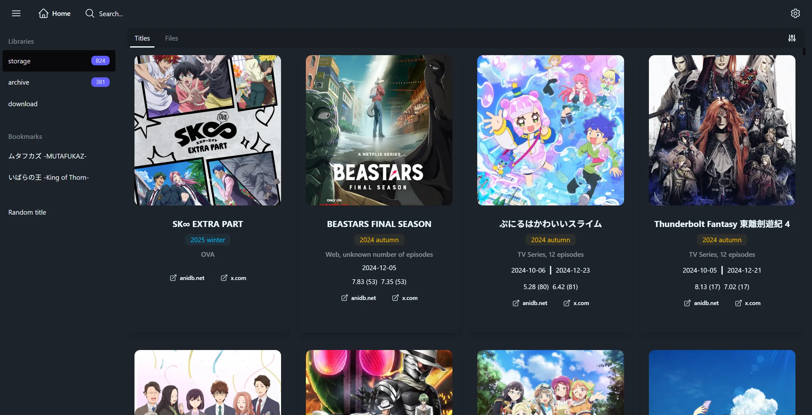
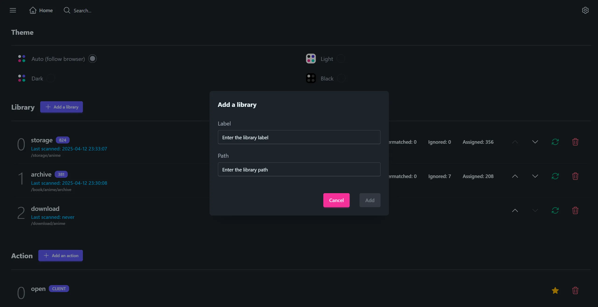
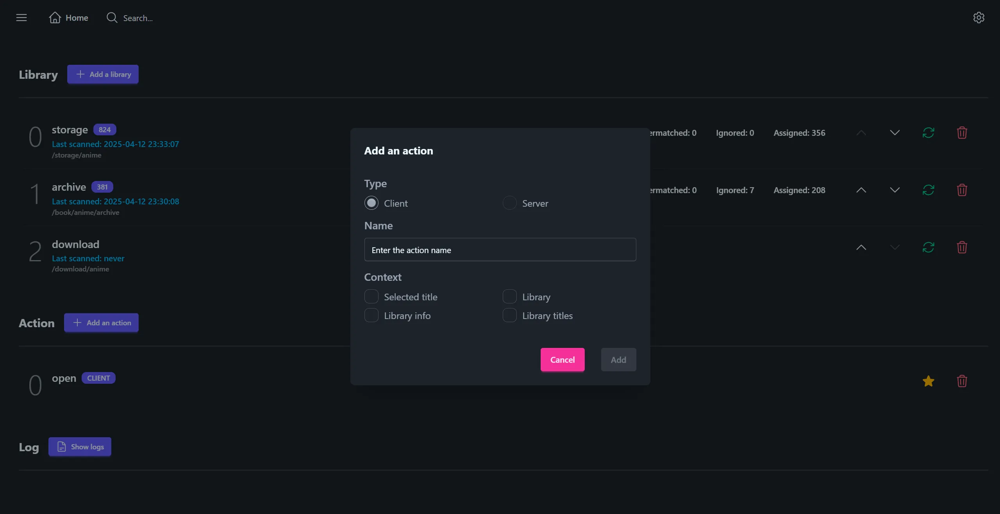

# Pan

## Introduction

Pan (Personal Anime Note) is a self-hosted web application designed for managing anime collections. Acting as a specialized file explorer, it offers a clean and intuitive interface to help you organize, browse, and interact with your anime files effortlessly.



### Key Features

- **Self-hosted**: Runs entirely on your machine. Once set up, no internet access is required to use the application
- **Fast scanning**: Uses only file names for scanning without hashing your files or reading their content, ensuring efficient performance
- **Customizable**: Set up your own client-side scripts to implement custom workflows, like opening files with preferred applications, checking for duplicate files, batch renaming/moving, and more

## Table of Contents

- [Pan](#pan)
  - [Introduction](#introduction)
    - [Key Features](#key-features)
  - [Table of Contents](#table-of-contents)
  - [Setup](#setup)
    - [Prerequisites](#prerequisites)
    - [Local Development Setup](#local-development-setup)
    - [Deployment with Docker](#deployment-with-docker)
  - [Configuration](#configuration)
    - [Login](#login)
    - [Add a library](#add-a-library)
    - [Add an action](#add-an-action)
      - [Client Action](#client-action)
      - [Server Action](#server-action)
  - [Acknowledgements](#acknowledgements)
  - [License](#license)

## Setup

### Prerequisites

- [Bun](https://bun.sh)

### Local Development Setup

1. Clone the repository:

   ```bash
   git clone https://github.com/wrsxr5/pan.git
   cd pan
   ```

2. Download the [zipped data file](https://drive.google.com/file/d/1XzGTUhrEAzTkcewuxEMhTLDgJGzZkmSV/view?usp=sharing) and extract its contents into the `./apps/server/data` folder. These files include prefetched anime title data. For details on the expected format, see [data.ts](apps/server/server/runtime/library/data.ts).

   After extraction, the structure should look like this:

   ```text
   ./apps/server/data
   ├── 🗂️ anime-titles.dat.gz
   ├── 📄 index.csv
   └── 📄 pan.bundle
   ```

   Note: These data files are only required for anime management features. You can skip this step if you intend to use Pan purely as a file manager and don't need anime title scanning or browsing.

3. Install dependencies:

   ```bash
   bun install --frozen-lockfile
   ```

4. (Optional) Run unit tests:

   ```bash
   bun test:server
   ```

   ```bash
   bun test:webui
   ```

5. Start the backend server:

   ```bash
   bun start
   ```

   Note: You can optionally use a test database by setting the `DATABASE_URL` environment variable before starting the server.

6. Serve the frontend (in a new terminal window):

   ```bash
   bun serve
   ```

   Note: The backend proxy is configured in [proxy.conf.json](apps/webui/src/proxy.conf.json). You can edit this file to connect the dev frontend to a different backend instance.

7. Access the application:

   Open your browser and navigate to `http://localhost:4200`

### Deployment with Docker

1. Clone the repository, download and extract data files:

   Follow steps 1 and 2 from the [Local Development Setup](#local-development-setup)

2. (Optional) Customize the configuration:

   Review and modify the [docker-compose.yml](docker-compose.yml) file to suit your needs (e.g., port mappings, volume mounts, environment variables).

3. Build and start the container:

   ```bash
   docker-compose up --build -d
   ```

4. Access the application:

   Open your browser and go to the container's URL with the port you configured.

## Configuration

### Login

When you first open the app, you'll be prompted with a login page.

Here, you can set your initial username and password. These credentials will be required for all future logins.

### Add a library

You can add a new library by specifying its label and path.

Once added, you have the option to scan the library to enable anime title browsing and management features. If you choose not to scan, or if you didn't provide the anime data files during setup, the library will still be accessible with basic file explorer functionality, but without any anime-specific features.

The scanner (see [scanner.ts](apps/server/server/runtime/scanner/scanner.ts)) traverses the specified library path and looks for folders that contain video files (`.mkv` or `.mp4`). When it finds a folder with at least one video file, it stops scanning deeper into that folder and attempts to match the folder name to an anime title.

After the scan is complete, you can review the detected titles and manually reassign any folders that were incorrectly matched.



Note: If you're deploying Pan with Docker, make sure to use the container's path when setting the library location.

For example, with the following volume mapping:

```yaml
volumes:
  - /media/anime:/anime
```

You should enter `/anime` as the library path (not `/media/anime`), since that's the path inside the container.

### Add an action

Pan can be customized by defining your own actions.

An action is essentially a script that you can execute within a specific directory. Think of it as an entry in the context menu of a file explorer, enhanced with additional metadata such as library information, the matched anime title, and even all scanned titles in the library.

You can set any action as the default, which means it will be automatically executed when you click a file entry in the interface.

For more details, refer to the [action.interface.ts](libs/types/src/interface/action.interface.ts) file.



#### Client Action

A client action is executed using a custom protocol handler defined in your operating system. For an example on Windows, refer to [install.reg](apps/client/reg/install.reg) where the registry editor is used (you can replace the last line with your own script).

Since a custom protocol is invoked using a URL, make sure the client action's name is URL-friendly (use dashes or underscores instead of spaces). For example: `my-client-action` instead of `my client action`.

You can refer to [client.ts](apps/client/client.ts) for an example of how to write a client action handler.

Keep in mind that if the server is hosted on a different machine, you may not have direct access to its files. In that case, you might need to map the server location to the client machine using protocols like Samba or similar.

#### Server Action

A server action is executed using the [Web Worker API](https://bun.sh/docs/api/workers).

Since this API is still evolving and not yet fully stable, use it cautiously. For an example of how to write a server action handler, see [example.worker.ts](apps/server/server/runtime/action/actions/example.worker.ts).

## Acknowledgements

This project is made possible thanks to the following open-source libraries and tools:

- [Bun](https://bun.sh): used as the server runtime
- [Fuse.js](https://www.fusejs.io): used for fuzzy matching of anime titles
- [Angular](https://angular.dev): used as the frontend framework
- [Tailwind CSS](https://tailwindcss.com) and [DaisyUI](https://daisyui.com): used for styling the user interface

## License

MIT License

```
Copyright (c) 2025 Wrasse Elixir V

Permission is hereby granted, free of charge, to any person obtaining a copy of this software and associated documentation files (the "Software"), to deal in the Software without restriction, including without limitation the rights to use, copy, modify, merge, publish, distribute, sublicense, and/or sell copies of the Software, and to permit persons to whom the Software is furnished to do so, subject to the following conditions:

The above copyright notice and this permission notice shall be included in all copies or substantial portions of the Software.

THE SOFTWARE IS PROVIDED "AS IS", WITHOUT WARRANTY OF ANY KIND, EXPRESS OR IMPLIED, INCLUDING BUT NOT LIMITED TO THE WARRANTIES OF MERCHANTABILITY, FITNESS FOR A PARTICULAR PURPOSE AND NONINFRINGEMENT. IN NO EVENT SHALL THE AUTHORS OR COPYRIGHT HOLDERS BE LIABLE FOR ANY CLAIM, DAMAGES OR OTHER LIABILITY, WHETHER IN AN ACTION OF CONTRACT, TORT OR OTHERWISE, ARISING FROM, OUT OF OR IN CONNECTION WITH THE SOFTWARE OR THE USE OR OTHER DEALINGS IN THE SOFTWARE.
```
